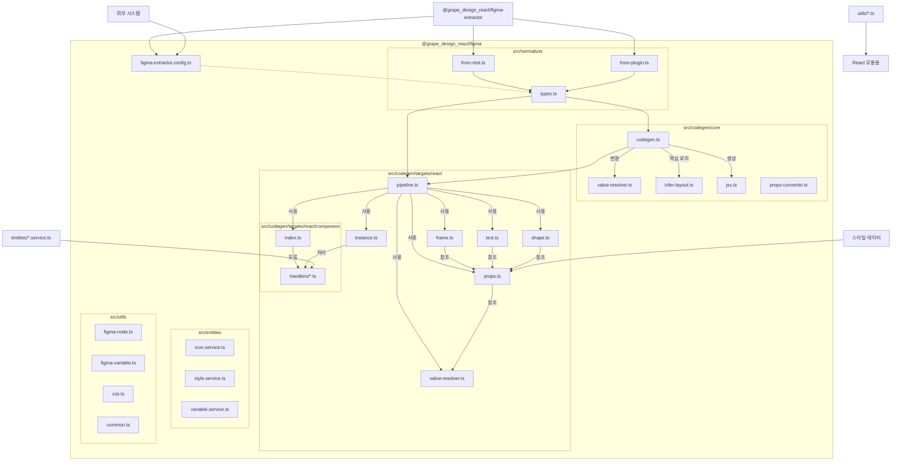
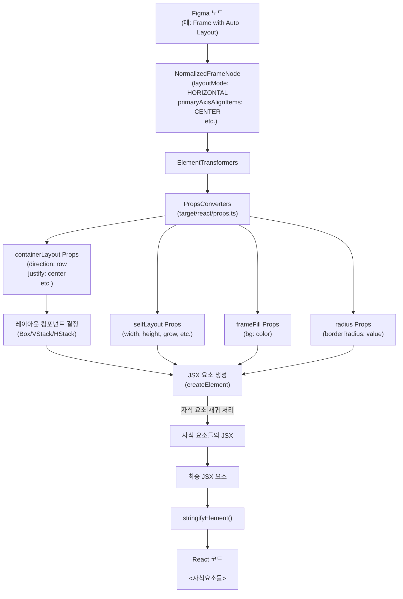

## 프로젝트 컨텍스트: `@grape_design_react/figma`

### 1. 프로젝트 개요 (Project Overview)

- **주된 목적:** Figma 파일에서 Seed Design 시스템 컴포넌트 및 스타일 정보를 추출하고, 이를 기반으로 **React 코드를 생성**하거나 관련 메타데이터를 제공하는 라이브러리입니다. Figma 디자인을 실제 코드로 변환하는 과정을 자동화하는 것을 목표로 합니다.
- **핵심 기능:**
  - Figma 파일 내 특정 규칙(이름 접두사 `🔵`, `🟢`)을 따르는 컴포넌트 및 컴포넌트 세트 필터링 (`figma-extractor.config.ts`).
  - Figma API 응답 (REST 또는 Plugin)을 내부 정규화된 데이터 구조로 변환 (`normalizer` 모듈).
  - 정규화된 Figma 노드 트리(Frame, Text, Instance 등)를 분석하여 **React JSX 코드 트리로 변환** (`codegen/core`, `codegen/targets/react` 모듈).
  - Figma 노드의 레이아웃(Auto Layout), 스타일(색상, 텍스트, 테두리 등) 속성을 **CSS-in-JS 스타일 props로 변환** (`codegen/targets/react/props.ts`, `codegen/targets/react/value-resolver.ts`).
  - Seed Design 시스템의 특정 Figma 컴포넌트 인스턴스를 **미리 정의된 React 컴포넌트 사용 코드로 변환** (`codegen/targets/react/component` 모듈).
- **주요 사용자:** Seed Design 시스템을 사용하여 개발하는 React 개발자, 디자인 시스템 자동화 도구.

### 2. 기술 스택 (Technology Stack)

- **주요 프로그래밍 언어:** TypeScript
- **주요 프레임워크 및 라이브러리:**
  - `@grape_design_react/figma-extractor`: Figma 데이터 추출 및 기본 변환.
  - `ts-pattern`: 타입 기반 패턴 매칭을 통한 분기 처리.
  - `change-case`: 문자열 케이스 변환 (컴포넌트/props 이름 생성 등에 활용 가능성).
  - (개발) `@figma/plugin-typings`, `@figma/rest-api-spec`: Figma 타입 정보.
- **데이터베이스:** 사용하지 않음.
- **주요 외부 서비스 또는 API 의존성:** Figma API (간접적으로 `@grape_design_react/figma-extractor` 및 `normalizer` 모듈을 통해 사용).
- **빌드 도구:** `bunchee`.

### 3. 아키텍처 개요 (Architecture Overview)

- **전체적인 시스템 아키텍처:** 설정 기반 데이터 추출, 정규화, 그리고 타겟 플랫폼(현재 React)별 코드 생성 파이프라인 아키텍처. 의존성 주입을 통해 각 단계의 구현을 분리하고 확장 가능하도록 설계되었습니다.
- **주요 모듈/컴포넌트 역할:**
  - `figma-extractor.config.ts`: Figma 데이터 추출 필터링 및 기본 변환 설정.
  - `src/normalizer`: Figma API 응답 데이터를 내부 `NormalizedSceneNode` 트리 구조로 변환.
  - `src/codegen/core`: 코드 생성의 핵심 로직.
    - `codegen.ts`: 노드 트리를 재귀적으로 순회하며 타입별 변환기(`ElementTransformer`)를 호출하는 메인 파이프라인.
    - `jsx.ts`: 내부 JSX 요소 표현(`ElementNode`) 생성 및 문자열 변환 유틸리티.
    - `infer-layout.ts`: Auto Layout 정보를 분석하여 레이아웃 관련 props 계산.
    - `value-resolver.ts`: Figma 값을 코드 값(예: CSS 값)으로 변환하는 로직의 **기반**(실제 구현은 타겟별).
    - `props-converter.ts`: Figma 속성을 타겟 props로 변환하는 로직의 **기반**(실제 구현은 타겟별).
  - `src/codegen/targets/react`: React 코드 생성 특화 로직.
    - `pipeline.ts`: React용 `ElementTransformer`, `PropsConverter`, `ValueResolver`, `ComponentHandler` 등을 생성하고 조립하여 최종 코드 생성기 인스턴스를 만듦.
    - `frame.ts`, `text.ts`, `shape.ts`, `instance.ts`: 각 Figma 노드 타입을 React 컴포넌트 (`Box`, `VStack`, `HStack`, `Text` 등) JSX로 변환하는 `ElementTransformer` 구현.
    - `props.ts`: Figma 속성을 React 컴포넌트 props (주로 스타일 객체 - CSS-in-JS 방식)로 변환하는 `PropsConverter` 구현. (매우 중요하고 상세한 로직 포함)
    - `value-resolver.ts`: Figma 값을 React 환경에 맞는 CSS 값 (문자열)으로 변환하는 `ReactValueResolver` 구현.
    - `component/`: Seed Design 시스템 컴포넌트 (Button, Avatar 등) 인스턴스를 해당 React 컴포넌트 사용 코드로 변환하는 `ComponentHandler` 구현 모음.
  - `src/entities`: Figma 객체(아이콘, 스타일, 변수) 데이터 접근을 위한 서비스/리포지토리 (현재 코드 생성 로직에서 직접적인 사용은 불분명, 메타데이터 제공 등에 활용 가능성).
  - `src/utils`: 공통 유틸리티 함수.
- **코드 구조:** 데이터 처리 단계 (정규화 -> 코어 로직 -> 타겟별 로직) 와 기능별 모듈화 (엔티티, 유틸리티) 가 잘 되어 있는 구조. 의존성 주입을 통해 각 모듈의 역할을 명확히 하고 테스트 용이성을 높임.

### 4. 핵심 기능 및 로직 (Core Functionality & Logic)

- **Figma 데이터 정규화:** Figma API로부터 받은 다양한 노드 데이터를 일관된 내부 `NormalizedSceneNode` 인터페이스로 변환하여 후속 처리 단계의 복잡성을 줄입니다 (`src/normalizer`).
- **React 코드 생성 파이프라인 (`src/codegen/targets/react/pipeline.ts`):**
  1.  Figma 노드 속성을 React props로 변환하는 여러 `PropsConverter` 생성 (레이아웃, 색상, 텍스트 스타일 등).
  2.  Figma 값을 CSS 값으로 변환하는 `ReactValueResolver` 생성.
  3.  Seed 컴포넌트 인스턴스를 처리하는 `ComponentHandler` 목록 준비.
  4.  각 Figma 노드 타입 (`FRAME`, `TEXT` 등)을 React JSX로 변환하는 `ElementTransformer`들을 생성 (Props 변환기, 값 변환기, 컴포넌트 핸들러 의존).
  5.  준비된 `ElementTransformer`들을 `createCodeGenerator` (`core` 모듈)에 주입하여 최종 코드 생성기 생성.
- **재귀적 JSX 트리 생성 (`src/codegen/core/codegen.ts`):** 생성된 코드 생성기는 Figma 노드 트리를 재귀적으로 순회하며 각 노드에 맞는 `ElementTransformer`를 호출하고, 그 결과로 내부 JSX 표현(`ElementNode`) 트리를 구축합니다.
- **Auto Layout 변환 (`src/codegen/targets/react/frame.ts`, `props.ts`):** Figma의 Auto Layout 속성(방향, 정렬, 간격, 패딩)을 분석하여 Seed Design의 레이아웃 컴포넌트(`VStack`, `HStack`, `Box`)와 해당 스타일 props(`direction`, `justify`, `align`, `gap`, `p`, `px`, `py` 등)로 변환합니다.
- **특정 컴포넌트 처리 (`src/codegen/targets/react/instance.ts`, `component/`):** Figma에서 컴포넌트 인스턴스를 만나면, 해당 컴포넌트 ID나 이름에 매핑되는 `ComponentHandler`를 찾아 실행합니다. 이를 통해 일반적인 노드 변환 대신 특정 React 컴포넌트(예: `<ActionButton>`)를 생성하고 Figma 속성을 해당 컴포넌트의 props로 매핑합니다. 핸들러가 없으면 기본 변환 로직(주로 Frame과 유사하게 처리)을 따릅니다.
- **스타일 속성 변환 (`src/codegen/targets/react/props.ts`):** 채우기, 선, 테두리 반경, 텍스트 스타일 등 다양한 시각적 속성을 CSS-in-JS 스타일 객체 형태로 변환하여 props로 전달합니다 (예: `bg`, `color`, `borderColor`, `borderWidth`, `borderRadius`, `textStyle` 등).

### 5. 데이터 모델 (Data Model)

```mermaid
flowchart LR
    figmaAPI["Figma API
    (REST/Plugin)"] --> normalizer["normalizer
    (from-rest.ts/from-plugin.ts)"]
    normalizer --> normNode["NormalizedSceneNode
    (Frame, Text, Rectangle, etc.)"]

    normNode --> createPipeline["createPipeline()
    (targets/react/pipeline.ts)"]

    subgraph "코드 생성 엔진 생성"
        createPipeline --> propsConverters["PropsConverters 생성
        (containerLayout, selfLayout,
        frameFill, radius, etc.)"]
        createPipeline --> componentHandlers["ComponentHandlers 생성
        (Button, Avatar, etc.)"]
        createPipeline --> transformers["ElementTransformers 생성
        (frame, text, instance, etc.)"]
        createPipeline --> codeGenerator["CodeGenerator 생성
        (core/codegen.ts)"]
    end

    normNode --> generateCode["generateCode(node, options)
    (재귀적 변환)"]
    codeGenerator --> generateCode

    subgraph "노드 변환 프로세스"
        generateCode --> traverse["traverse(node)
        (노드 타입에 따라 분기)"]

        traverse --> frameTransformer["frameTransformer
        (Auto Layout 처리)"]
        traverse --> textTransformer["textTransformer"]
        traverse --> instanceTransformer["instanceTransformer
        (컴포넌트 처리)"]
        traverse --> otherTransformers["기타 Transformers
        (rectangle, vector, etc.)"]

        frameTransformer --> layoutInference["레이아웃 추론
        (infer-layout.ts)"]
        frameTransformer --> propsConversion["Props 변환
        (props.ts)"]
        frameTransformer --> elementCreation["JSX 요소 생성
        (Box/VStack/HStack)"]

        instanceTransformer --> componentHandler["컴포넌트 핸들러 검색
        (component/*.ts)"]
        componentHandler -- "핸들러 있음" --> customComponent["커스텀 컴포넌트 생성
        (<Button>, <Avatar>, etc.)"]
        componentHandler -- "핸들러 없음" --> frameTransformer

        textTransformer --> textProps["텍스트 Props 변환"]
        textTransformer --> textElement["Text 요소 생성"]
    end

    subgraph "JSX 변환"
        elementCreation --> jsxTree["ElementNode 트리
        (JSX 중간 표현)"]
        customComponent --> jsxTree
        textElement --> jsxTree
        otherTransformers --> jsxTree

        jsxTree --> stringifyElement["stringifyElement()
        (JSX 문자열 변환)"]
    end

    stringifyElement --> reactCode["React 코드 (JSX)"]
```

- **핵심 입력 데이터:** Figma API 응답 (REST 또는 Plugin).
- **내부 정규화 모델:** `NormalizedSceneNode` 및 하위 타입들 (`NormalizedFrameNode`, `NormalizedTextNode` 등 - `src/normalizer/types.ts` 정의). Figma 노드의 속성들을 일관된 형식으로 표현.
- **코드 생성 중간 표현:** `ElementNode` (`src/codegen/core/jsx.ts`). JSX 구조를 표현하는 내부 트리 데이터 구조.
- **핵심 출력 데이터:** React 코드 문자열 (JSX).

### 6. 시작점 및 주요 흐름 (Entry Points & Main Flows)

- **라이브러리 사용:** 외부 스크립트나 애플리케이션에서 이 패키지를 import하여 사용.
  - 주요 함수: `createPipeline` (`targets/react/pipeline.ts`)을 호출하여 React 코드 생성기 인스턴스를 얻고, 이 인스턴스의 `generateCode` 또는 `generateJsxTree` 메서드를 호출.
  - 입력: `generateCode`/`generateJsxTree` 메서드에 Figma 노드 데이터 (`NormalizedSceneNode`)와 코드 생성 옵션 (`CodegenOptions`) 전달.
  - 흐름: `generateCode` -> `generateJsxTree` -> `traverse` (재귀 호출) -> 각 노드 타입별 `ElementTransformer` 호출 -> (내부적으로 `PropsConverter`, `ValueResolver`, `ComponentHandler` 등 사용) -> `ElementNode` 트리 생성 -> `stringifyElement` -> 최종 React 코드 문자열 반환.

### 7. 설정 및 환경 변수 (Configuration & Environment Variables)

- **주요 설정 파일:**
  - `packages/figma/figma-extractor.config.ts`: Figma 데이터 추출 필터링 및 기본 변환 규칙 정의.
  - 코드 생성 옵션 (`CodegenOptions`): 코드 생성기(`createPipeline` 등) 사용 시 인자로 전달. (예: `shouldInferAutoLayout`, `shouldPrintSource`)
- **중요한 환경 변수:** 명시적인 사용은 확인되지 않음. Figma API 통신을 위한 토큰 등은 `@grape_design_react/figma-extractor` 또는 상위 실행 환경에서 관리될 것으로 추정.

### 8. 주의사항 또는 특이점 (Caveats or Peculiarities)

- **Seed Design 시스템 의존성:** 코드 생성 결과물(컴포넌트 이름 `VStack`, `HStack`, `Box` 등, 특정 컴포넌트 핸들러)이 Seed Design React 라이브러리에 의존적입니다.
- **이름 규칙 의존성:** 데이터 추출 시 Figma 컴포넌트/세트 이름 접두사(`🔵`, `🟢`)에 의존합니다.
- **CSS-in-JS 가정:** 생성되는 스타일 코드는 CSS-in-JS 라이브러리(예: Emotion, Styled Components) 사용을 가정하는 것으로 보입니다 (스타일 객체를 props로 전달).
- **확장성:** `createPipeline`의 `extend.componentHandlers` 옵션을 통해 Seed Design 외의 커스텀 컴포넌트 처리 로직을 추가할 수 있습니다.
- **정확도 한계:** Figma의 모든 기능을 완벽하게 코드로 변환하는 것은 불가능할 수 있으며, 특히 복잡한 벡터 그래픽, 혼합 모드, 효과 등은 단순화되거나 지원되지 않을 수 있습니다 (`vectorTransformer`, `booleanOperationTransformer`는 상대적으로 간단하게 구현됨). `UNHANDLED` 노드 타입 처리도 고려해야 합니다.
